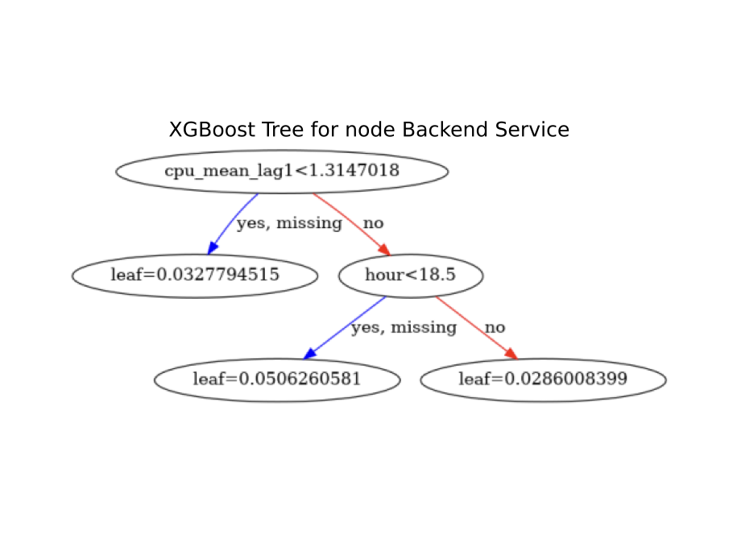
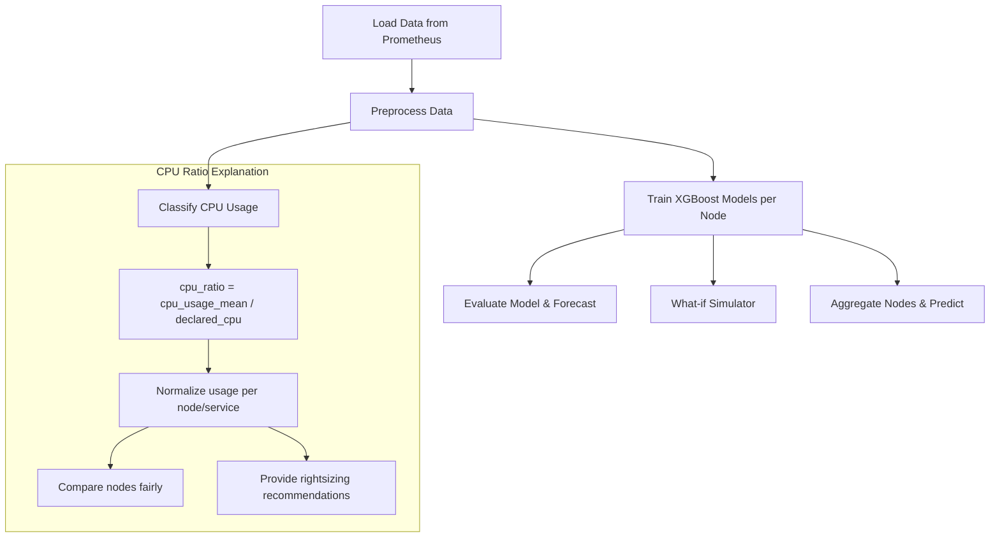
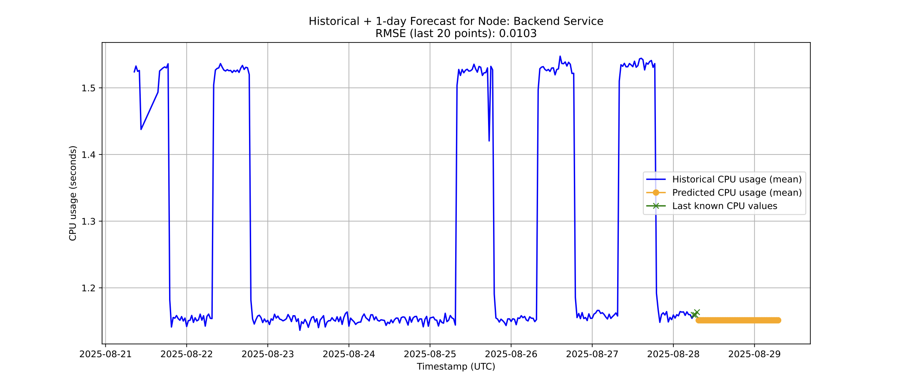
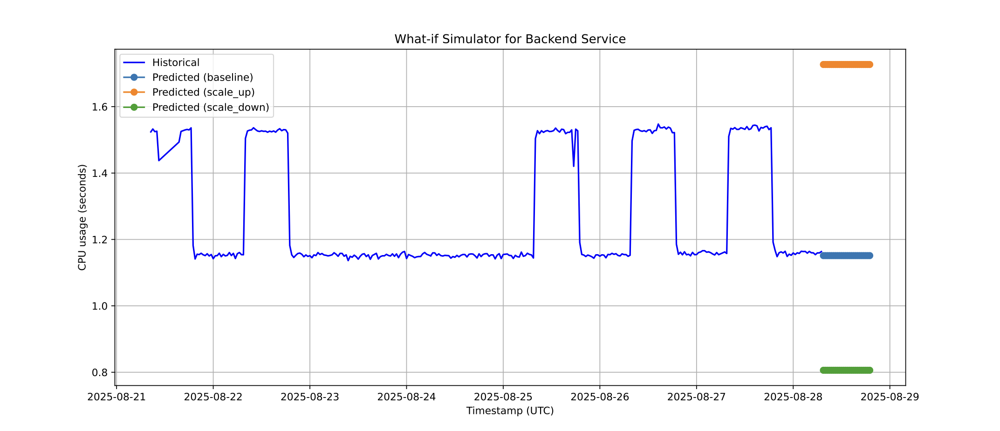
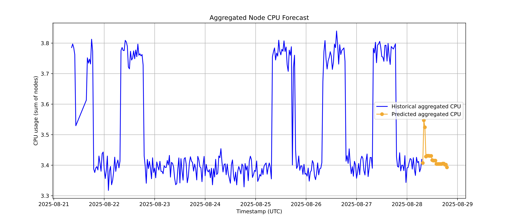

# Kubeflow CPU Usage Monitoring & Forecasting Pipeline

This Kubeflow pipeline provides end-to-end monitoring, forecasting, and simulation of CPU usage for Kubernetes clusters. It collects metrics from Prometheus, preprocesses data, trains XGBoost models, evaluates predictions, classifies CPU utilization, and performs “what-if” simulations for resource planning.

---

## Table of Contents

1. [Overview](#overview)
2. [Pipeline Steps](#pipeline-steps)

   * [Load Data from Prometheus](#step-1-load-data-from-prometheus)
   * [Preprocess Data](#step-2-preprocess-data)
   * [Train Model](#step-3-train-model)
   * [Evaluate Model](#step-4-evaluate-model)
   * [Classify CPU Usage](#step-5-classify-cpu-usage)
   * [What-if Simulator](#step-6-what-if-simulator)
   * [Aggregate Nodes & Predict](#step-7-aggregate-nodes-and-predict)
3. [Requirements](#requirements)
4. [Installation](#installation)
5. [Running the Pipeline](#running-the-pipeline)
6. [Outputs](#outputs)
7. [Pipeline Diagram](#mermaid-diagram)


---

## Overview

The `kcd_Bulgaria` Kubeflow pipeline automates CPU monitoring and prediction for Kubernetes nodes. It provides insights into resource usage, helps detect trends, and supports operational decisions such as scaling or adjusting CPU allocations.

The pipeline is modular, making it easy to adapt to other metrics (memory, network) or other clusters.

---

## Pipeline Steps

### Step 1: Load Data from Prometheus

**Component:** `load_data_from_prometheus`

* Connects to a Prometheus server to fetch CPU usage metrics (`container_cpu_usage_seconds_total`) over the last 7 days.
* Queries are done per day with a 60-second step to capture high-resolution time-series data.
* Extracted fields include timestamp, CPU usage, namespace, pod, container, and node.
* Outputs a CSV file containing raw CPU usage metrics.

**Key Notes:**

* Only collects containers with valid node and pod labels.
* This step ensures you have a historical baseline to build features and models.

---

### Step 2: Preprocess Data

**Component:** `preprocess_data`

* Reads the CSV from the previous step.
* Multiplies CPU usage by a factor of 10 (scaling or unit conversion).
* Filters only relevant nodes and maps them to human-readable labels:

  * `mira-kubeflow2-worker3` → `Frontend UI`
  * `mira-kubeflow2-worker4` → `Backend Service`
  * `mira-kubeflow2-worker5` → `Database`
* Converts timestamps to `datetime` and aggregates CPU usage per 30-minute intervals: mean, min, max.
* Adds temporal features: weekday, hour, month, day, and `is_weekend`.
* Creates **lag features** for last 3 intervals of mean, min, max CPU usage to capture recent trends.
* Creates **rolling features** for averages/max over last 2–3 intervals (excluding current), helping detect momentum/trends.
* Removes rows with missing values.

**Output:** Cleaned CSV ready for modeling.

**Importance:** These features are critical for time-series forecasting, enabling XGBoost models to detect patterns over time.

---

### Step 3: Train Model

**Component:** `train_model`

* Trains separate **XGBoost regression models per node** to predict mean CPU usage.
* Splits data into training and testing sets (last few points for validation).
* Hyperparameters:

  * `n_estimators=200`
  * `learning_rate=0.05`
  * `max_depth=5`
  * `subsample=0.8`
* Early stopping is used to prevent overfitting.
* Saves models as `.joblib` files.
* Generates PDF visualizations of **XGBoost decision trees** for each node.

**Why per-node models?** CPU usage patterns differ across nodes; per-node modeling improves accuracy.

---

### Step 4: Evaluate Model

**Component:** `evaluate_model`

* Computes **RMSE** on the last 20 observed points to evaluate model accuracy.
* Performs **multi-step forecasting** for 1 day (48 intervals of 30 minutes).
* Uses lag and rolling features in a sequential prediction (feeding predicted values for the next step).
* Plots historical CPU usage, last known values, and forecasts in a PDF.
* Generates a textual report with RMSE per node.

**Benefit:** Helps visualize how well the model predicts and provides actionable insights for operations.

---

### Step 5: Classify CPU Usage

**Component:** `classify_cpu_usage`

* Compares actual CPU usage against **declared CPU resources** per node.
* Computes `cpu_ratio = cpu_usage_mean / declared_cpu`, which **normalizes CPU usage**:

  **What it does:**  
  Calculates the fraction of declared/allocated CPU resources actually being used on average.

  **Why it’s useful:**  
  * **Comparability across nodes/services**  
    Nodes may have different allocated CPUs. `cpu_ratio` makes it easy to see which nodes are truly under- or over-utilized:  
    * `0.1` → uses 10% → overprovisioned  
    * `0.5` → uses ~50% → optimal  
    * `0.9` → near limit → risk of throttling or OOM  

  * **Direct link to recommendations**  
    * ratio < 0.1 → resources wasted → consider reducing requests/limits  
    * ratio > 0.5 → approaching capacity → consider scaling up or increasing CPU  

  * **Abstraction**  
    You think in "percent of allocated resources used" rather than raw CPU seconds, giving a clearer metric for rightsizing.

  **Alternatives:**  
  * Use `cpu_usage_mean / cpu_request` to compare against Kubernetes pod spec requests directly.  
  * Consider `p95/p99` of the ratio instead of the mean to capture peak utilization.

* Classifies usage:  
  * `< 0.1` → Low usage  
  * `0.1–0.5` → Optimal  
  * `> 0.5` → High usage  

* Provides **recommendations** based on classification.  
* Outputs a PDF with usage classification and trends per node.

---

### Step 6: What-if Simulator

**Component:** `what_if_simulator`

* Simulates CPU usage under different scaling scenarios:

  * `baseline` → current resources
  * `scale_up` → +50% CPU
  * `scale_down` → -30% CPU
* Uses the trained XGBoost models to predict how CPU usage would evolve under each scenario.
* Produces plots comparing historical usage with scenario-based predictions.

**Purpose:** Supports operational decisions and capacity planning by visualizing potential outcomes of scaling actions.

---

### Step 7: Aggregate Nodes and Predict

**Component:** `aggregate_nodes_and_predict`

* Aggregates CPU predictions from individual nodes to a cluster-level view.
* Performs multi-step prediction over 12 hours (24 intervals of 30 min).
* Plots aggregated historical CPU usage and predicted sum in a PDF.

---

## Requirements

* Kubeflow Pipelines
* Python 3.10
* Prometheus server accessible from pipeline
* Internet access for package installation

**Python packages** are automatically installed inside each component.

---

## Installation

1. Install Kubeflow Pipelines: [Kubeflow Pipelines Installation Guide](https://www.kubeflow.org/docs/components/pipelines/installation/)
2. Clone the repository:

```bash
git clone https://github.com/VelmiraPetkova/cncf-kcd-sofia.git
cd cncf-kcd-sofia.git
````

3. Compile the pipeline:

```bash
python pipeline_script.py
```

This generates `KCD_Pipeline_Demo.yaml`.

---

## Running the Pipeline

1. Upload `KCD_Pipeline_Demo.yaml` to Kubeflow Pipelines UI.
2. Create a new experiment (e.g., `CPU_Usage_Monitoring`).
3. Launch the pipeline with default parameters.
4. Monitor execution and view outputs in the Kubeflow UI.

```bash
kubectl port-forward -n kubeflow svc/ml-pipeline-ui 8080:80
kfp pipeline create -p KCDBulgariataiDemo KCD_Pipeline_Demo.yaml
```

---

## Outputs

* **CSV files**: Raw and processed CPU metrics
* **Joblib models**: Trained XGBoost models per node
* **PDF reports**:

  
*  
  * Forecast vs historical CPU usage
  * CPU usage classification and recommendations
  * What-if scenario simulation
  * Aggregated node predictions

---

## Pipeline Diagram



## Example Outputs

Here’s an example of the pipeline output for the Backend Service node:

**Historical + Forecast Plot (24h):**



- Most of the time CPU usage is around 1.5, with short dips.
- Shows lower usage during weekends and off-hours.

**What-if Simulation Example:**



- Baseline, scale-up (+50%), and scale-down (-30%) scenarios.
- Helps plan resource adjustments proactively.

**Aggregated Node CPU Forecast:**




